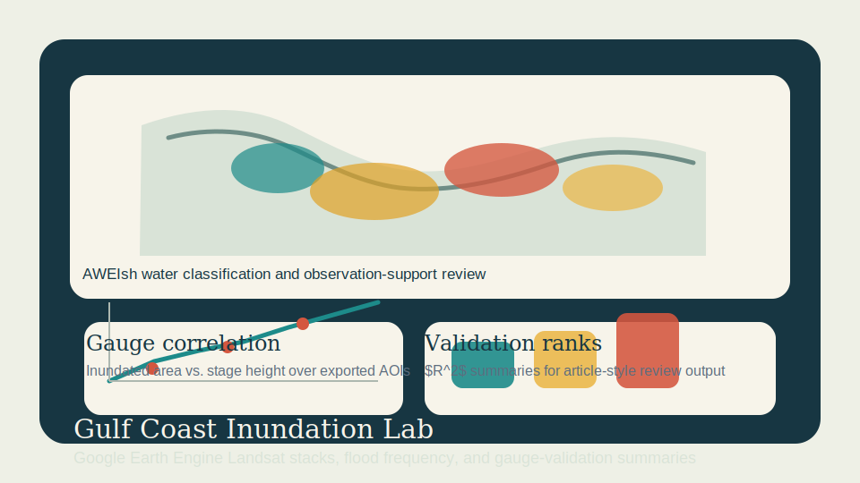

# Gulf Coast Inundation Lab

Remote sensing portfolio project recreating a Gulf Coast flood-inundation study with Google Earth Engine, Landsat classification, and gauge-validation summary workflows.



## Review Artifacts

- Example output: [EXAMPLE_OUTPUT.md](EXAMPLE_OUTPUT.md)
- Data-flow diagram: [docs/data-flow.md](docs/data-flow.md)

## Snapshot

- Lane: Remote sensing and inundation mapping
- Domain: Gulf Coast flood-frequency analysis
- Stack: Google Earth Engine JavaScript, Landsat Collection 2, JRC water occurrence, Python
- Includes: Earth Engine mapping scripts, real ten-gauge validation manifest, gauge-export workflow, local validation summary CLI, sample merged gauge CSV, tests

## Overview

This project recreates the structure of your Gulf Coast inundation article as a practical, publishable repo. The Earth Engine side builds a regional Landsat stack, masks clouds and shadows with QA bits, classifies water using AWEIsh, and exports inundation-frequency products for HUC regions 03, 08, and 12. The local Python side summarizes exported gauge-validation tables into an article-ready correlation report so the repo remains useful outside the Earth Engine Code Editor.

## What It Demonstrates

- Region-scale Landsat preprocessing and QA masking in Google Earth Engine
- AWEIsh-based water classification with a configurable visual-break threshold
- Inundation-frequency mapping from multi-decadal image stacks
- Export-ready AOI summaries for gauge validation
- An object-oriented local workflow for correlation summaries and review output

## Project Structure

```text
gulf-coast-inundation-lab/
|-- assets/
|   `-- gulf-coast-inundation-preview.svg
|-- data/
|   |-- gauge_validation_manifest.geojson
|   |-- gauge_validation_sample.csv
|   `-- gauge_validation_manifest_readme.md
|-- docs/
|   |-- architecture.md
|   |-- demo-storyboard.md
|   `-- gee-runbook.md
|-- earthengine/
|   |-- gauge_validation_export.js
|   `-- gulf_coast_inundation_frequency.js
|-- outputs/
|   `-- .gitkeep
|-- src/gulf_coast_inundation_lab/
|   |-- __init__.py
|   |-- validation.py
|   `-- workflow_base.py
|-- tests/
|   `-- test_validation.py
|-- pyproject.toml
`-- README.md
```

## Current Output

The local CLI writes `outputs/gulf_coast_validation_summary.json` with:

- per-gauge $R^2$ values and validation categories
- observation counts and stage/inundation ranges
- strongest and weakest gauge summaries
- adequate-validation counts using the article-style $R^2 > 0.6$ rule
- run-registry metadata for repeated review runs

The Earth Engine scripts provide:

- a multi-decadal inundation-frequency raster
- an episodic inundation layer with permanent water suppressed
- observation-support counts for low-coverage review
- AOI-level CSV exports for gauge validation

The checked-in validation manifest provides:

- ten public USGS gauges distributed across HUC2 regions `03`, `08`, and `12`
- coordinates ready for GeoJSON upload into Earth Engine as a feature collection
- suggested AOI buffer sizes and priority notes for validation setup

## Quick Start

Run the local validation helper:

```bash
pip install -e .[dev]
gulf-coast-validation
pytest
```

Open the Earth Engine scripts in the GEE Code Editor and follow [docs/gee-runbook.md](docs/gee-runbook.md) for:

- study-area setup
- inundation-frequency export
- AOI validation export
- NWIS stage merge workflow

## Data Note

The file `data/gauge_validation_manifest.geojson` contains a real ten-gauge candidate set using public USGS stations across the Gulf Coast study area. The file `data/gauge_validation_sample.csv` remains a small merged example for the local validation CLI.

The actual inundation rasters are intended to be generated from public Landsat collections in Google Earth Engine rather than stored in this repository.

See [docs/architecture.md](docs/architecture.md) for the method notes.
See [docs/demo-storyboard.md](docs/demo-storyboard.md) for the reviewer walkthrough.
See [docs/gee-runbook.md](docs/gee-runbook.md) for the Earth Engine execution flow.