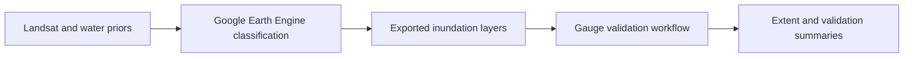

# Data Flow

```mermaid
flowchart LR
    A[Landsat and water priors] --> B[Google Earth Engine classification]
    B --> C[Exported inundation layers]
    C --> D[Gauge validation workflow]
    D --> E[Extent and validation summaries]
```

This diagram shows how remote-sensing inputs become validated inundation outputs.